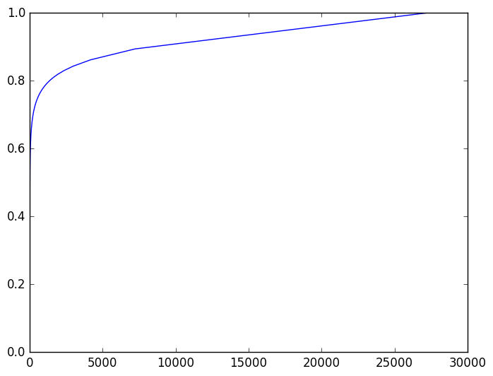

#noungroups

__Note that this is a preview of what is to come, I am currently on step 6__

*Use noungroups to precisely recognize entities in text*

noungroups is an extension of a named entity recognizer (NER). Most NERs take text and can broadly categorize entities, for example as people or locations. noungroups is much more precise, making it easy for you to input your text and find out what it's talking about.

For example, whereas [Stanford's NER](http://nlp.stanford.edu/software/CRF-NER.shtml) takes the sentence: 'Barack Obama is the president of the United States' and identifies a person and a location, noungroups identifies a national leader and a country.

noungroups is the simple result of a long process that had the following steps:

1. Download [English language Wikipedia dump](https://archive.org/details/enwiki-20080103)
2. Extract plain text articles from  XML with the handy [wikiextractor](https://github.com/attardi/wikiextractor/wiki)
3. Tag each word with its part of speech with the powerful [spaCy](https://github.com/spacy-io/spaCy)
4. Vectorize each tagged word (à la [sense2vec](http://arxiv.org/abs/1511.06388)) with the speedy [Gensim port](https://github.com/piskvorky/gensim/) of [Google's word2vec](https://code.google.com/archive/p/word2vec/)
5. Filter out just the nouns/entities and sort them by frequency of appearance in English language Wikipedia
6. Find the optimal number of clusters of the 100,000 most frequent nouns/entities with the smoothly parallelized [Spark implementation](http://spark.apache.org/docs/latest/mllib-clustering.html) of [k-means ||](http://theory.stanford.edu/~sergei/papers/vldb12-kmpar.pdf)
7. Label those clusters
8. Create a web service with an API that takes your textblobs, part of speech tags the words, and returns the corresponding categorization for each noun/entity based on the labeled clusters.

## Details on some of the above

### Part of speech tagging
Every word has a part of speech.  For example, in the sentence 'the bird ate seeds' the four words are a determiner, a noun, a verb, and a noun, respectively.

### word2vec
word2vec is an algorithm for converting words into vectors.  Excitingly, it was found that the vector representation of a word has encodes some of the semantic meaning of the word.  For example, if you take the vector for 'king', subtract the vector for 'man', and add the vector for 'woman', you get the vector for 'queen'.

Additionally, it was found that the same could be done for other conceptually-related words, such as nations and capitals.


From this image of word vectors projected down to two dimensions, it's clear that conceptually-related words occupy regions together.  That was the motivation for this project.

### sense2vec
One limitation of word2vec is that it treats words with multiple meanings as though they only have one.  For example, the word 'duck' is both a noun and a verb, but word2vec gives 'duck' just one vector representation, instead of two.  sense2vec is a proposed improvement that consists the pre-processing step of part of speech tagging the words before they go into word2vec.  Thus, instead of 'She had to duck when the duck flew by' we have 'She|NOUN had|VERB to|PART duck|VERB when|ADV the|DET duck|NOUN flew|VERB by|ADP'.  'duck' and 'duck' become 'duck|VERB' and 'duck|NOUN', two unique words that get two unique vectors.

### Filtering nouns/entities
After the part of speech tagging and vectorizing were finished, I had just over 27 million unique nouns/entities (27,137,917) and their vector representations.  I decided to filter that down to the top 100,000 most frequently used in order to reduce the time required for the clustering step.  Additionally, my intuition told me that ignoring less frequent nouns/entities would reduce noise in the clustering step.

Here's a chart of the cumulative frequency of nouns/entities.  The x-axis is in 1000s.  The line doesn't reach 1 because I removed a few outlier noun/entities that spaCy tagged, such as 'she' and 'he', that had significantly higher frequencies than other words.




Read about sense2vec here:

https://spacy.io/blog/sense2vec-with-spacy

You can use an online demo of the technology here:

https://sense2vec.spacy.io

We're currently refining the API, to make this technology easy to use. Once we've completed that, you'll be able
to download the package on PyPi. For now, the code is available to clarify the blog post.

There are three relevant files in this repository:

#### bin/merge_text.py

This script pre-processes text using spaCy, so that the sense2vec model can be trained using Gensim.

#### bin/train_word2vec.py

This script reads a directory of text files, and then trains a word2vec model using Gensim. The script includes its own
vocabulary counting code, because Gensim's vocabulary count is a bit slow for our large, sparse vocabulary.

#### sense2vec/vectors.pyx

To serve the similarity queries, we wrote a small vector-store class in Cython. This made it easier to add an efficient
cache in front of the service. It also less memory than Gensim's Word2Vec class, as it doesn't hold the keys as Python
unicode strings.

Similarity queries could be faster, if we had made all vectors contiguous in memory, instead of holding them
as an array of pointers. However, we wanted to allow a `.borrow()` method, so that vectors can be added to the store
by reference, without copying the data.

Usage
-----

The easiest way to download and install the model is by calling ```python -m sense2vec.download``` after installing sense2vec, e.g., via ```pip install -e git+git://github.com/spacy-io/sense2vec.git#egg=sense2vec```:

```
>>> import sense2vec
>>> model = sense2vec.load()
>>> freq, query_vector = model["natural_language_processing|NOUN"]
>>> model.most_similar(query_vector, n=3)
(['natural_language_processing|NOUN', 'machine_learning|NOUN', 'computer_vision|NOUN'], <MemoryView of 'ndarray'>)
```

**IMPORTANT** The API is work-in-progress and is subject to change.

For additional performance experimental support for BLAS can be enabled by setting the `USE_BLAS` environment variable before installing (e.g. ```USE_BLAS=1 pip install ...```). This requires an up-to-date BLAS/OpenBlas/Atlas installation.

Support
-------

* CPython 2.6, 2.7, 3.3, 3.4, 3.5 (only 64 bit)
* OSX
* Linux
* Windows
